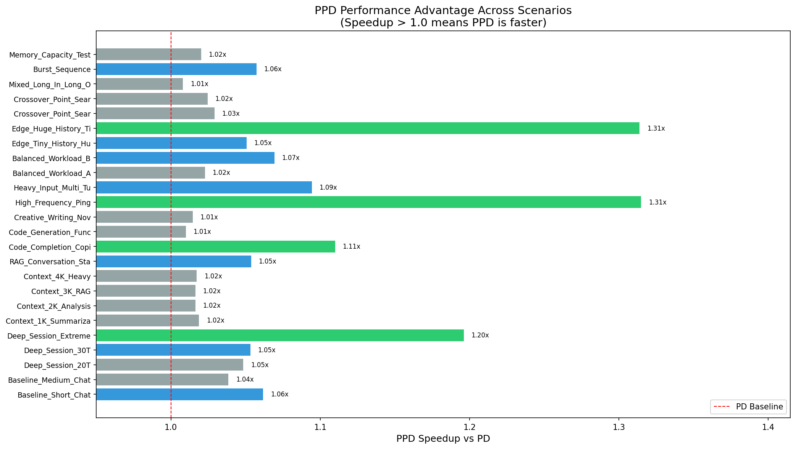
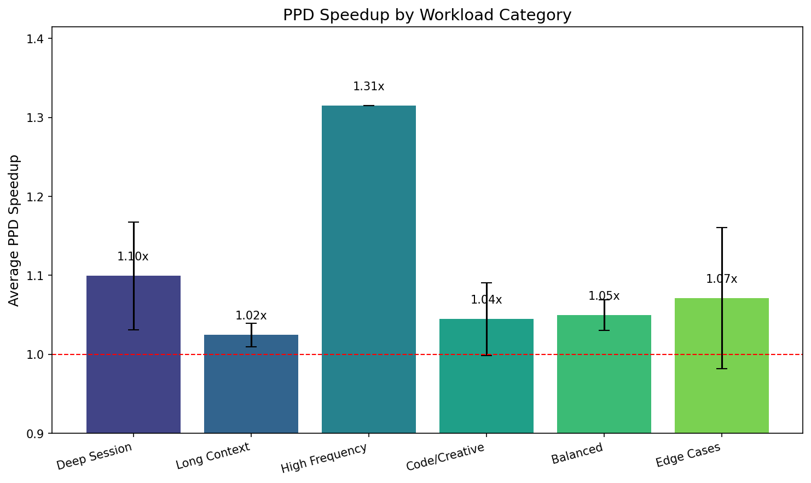
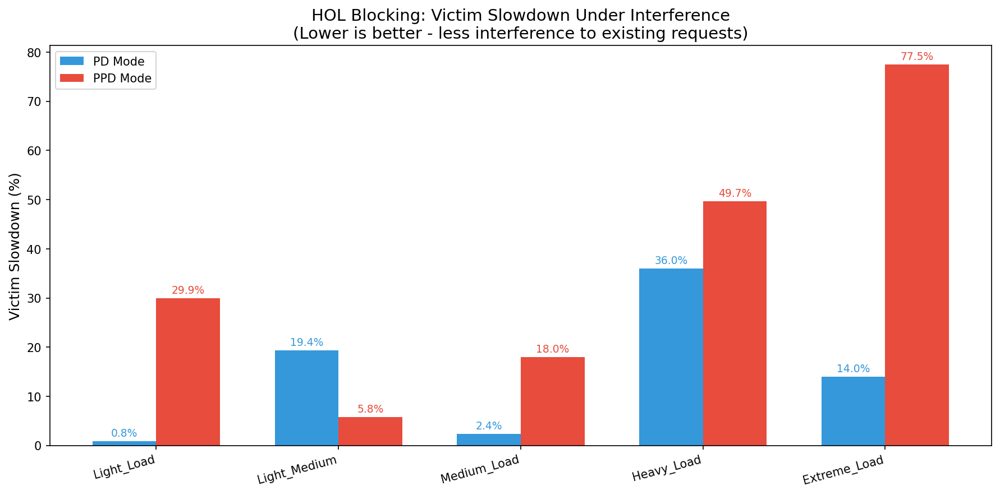
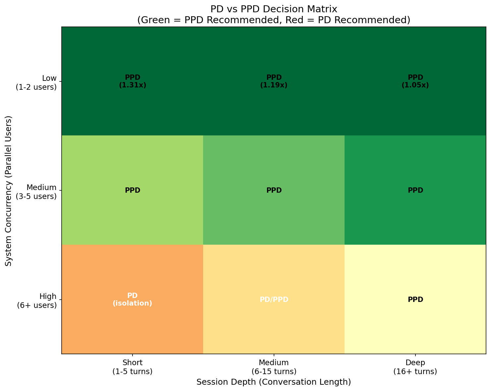

# PD vs PPD Performance Analysis

## Executive Summary

This document presents a comprehensive analysis of **Prefill-Decode Disaggregation (PD)** vs **Prompt-aware PD (PPD)** modes for vLLM inference serving. Based on extensive benchmarking across 24 scenarios and 5 concurrency stress tests, we provide quantitative guidance on when to use each mode.

### Key Findings

| Metric | Result |
|--------|--------|
| **PPD Speedup (Single-Request)** | 1.008x - 1.315x faster than PD |
| **Best PPD Scenario** | High-frequency short requests (1.31x speedup) |
| **HOL Blocking Impact** | PPD suffers 5-77% more slowdown under concurrent load |
| **Recommended Strategy** | PPD for low concurrency, PD for high concurrency |

---

## 1. Benchmark Results: Single-Request Performance

### 1.1 Overall Performance

PPD mode is faster than PD mode in **all 24 benchmark scenarios** when measuring single-request latency:

- **Mean Speedup**: 1.069x
- **Max Speedup**: 1.315x (High-Frequency Ping scenario)
- **Min Speedup**: 1.008x (Mixed Long Input/Output scenario)



### 1.2 Performance by Workload Category

| Category | Mean Speedup | Best Scenario |
|----------|--------------|---------------|
| **High Frequency** | 1.31x | 20 turns, 10 tokens each |
| **Deep Session** | 1.10x | 50-turn conversation |
| **Edge Cases** | 1.07x | Huge history, tiny input |
| **Balanced** | 1.05x | Gradual lengthening |
| **Long Context** | 1.02x | 3K token RAG documents |
| **Code/Creative** | 1.01x | Long output generation |



### 1.3 Why PPD is Faster

PPD eliminates KV cache transfer for Turn 2+ requests by using **D-direct mode**:

```
PD Mode (Always P→D):
  Turn 1: P prefill → KV transfer → D decode
  Turn 2: P prefill → KV transfer → D decode (full transfer each time)
  Turn N: P prefill → KV transfer → D decode

PPD Mode (D-direct for Turn 2+):
  Turn 1: P prefill → KV transfer → D decode (same as PD)
  Turn 2: D-direct (prefill + decode on D, no transfer!)
  Turn N: D-direct (reuses cached KV on D)
```

**Key Insight**: The more turns in a conversation, the more KV transfer overhead PPD eliminates.

---

## 2. Concurrency Analysis: HOL Blocking

### 2.1 What is HOL Blocking?

**Head-of-Line (HOL) Blocking** occurs when new prefill requests block ongoing decode operations:

```
Scenario: 4 users chatting, 1 new user sends large RAG document

PPD Mode:
  - Users 1-4 are in Turn 2+ (D-direct decode on D)
  - New user's Turn 2 arrives (needs D-direct PREFILL on D)
  - D must STOP decoding for users 1-4 to prefill new request
  - Result: Users 1-4 experience latency spike (HOL blocking)

PD Mode:
  - Users 1-4 are decoding on D
  - New user's request arrives
  - P handles prefill, D continues decoding
  - Result: Users 1-4 barely affected (P/D isolation)
```

### 2.2 HOL Blocking Test Results

| Scenario | Victims | Intruders | PD Slowdown | PPD Slowdown | Winner |
|----------|---------|-----------|-------------|--------------|--------|
| Light Load | 4 | 1 x 1K | 0.8% | **29.9%** | PD |
| Light-Medium | 4 | 2 x 2K | 19.4% | **5.8%** | PPD |
| Medium Load | 6 | 3 x 4K | 2.4% | **18.0%** | PD |
| Heavy Load | 6 | 5 x 8K | 36.0% | **49.7%** | PD |
| Extreme Load | 8 | 6 x 10K | 14.0% | **77.5%** | PD |



### 2.3 Analysis

- **PD wins 4/5 scenarios** when measuring victim slowdown under interference
- **PPD's isolation weakness** becomes severe under heavy load (77% slowdown)
- **PD's isolation advantage** limits slowdown even with many large intruders
- **Exception**: Light-Medium scenario shows PPD winning, likely due to:
  - Small intruder count (2)
  - KV transfer overhead exceeding prefill blocking cost

---

## 3. Decision Framework

### 3.1 When to Use PPD

PPD is recommended when:

1. **Low Concurrency** (1-3 simultaneous users)
   - HOL blocking risk is minimal
   - PPD's speedup advantage (1.05-1.31x) dominates

2. **Deep Conversations** (10+ turns)
   - More turns = more KV transfer savings
   - Speedup increases with conversation depth

3. **High-Frequency Short Requests**
   - Minimal prefill time, maximum transfer overhead
   - PPD shows 1.31x speedup

4. **Latency-Critical Single-User Applications**
   - Chat assistants, code completion, creative writing
   - No concurrent interference concerns

### 3.2 When to Use PD

PD is recommended when:

1. **High Concurrency** (6+ simultaneous users)
   - P/D isolation prevents HOL blocking
   - Protects existing users from new request interference

2. **Bursty RAG/Document Workloads**
   - Large prefill requests can block D for 100s of ms
   - PD keeps D focused on decode only

3. **SLA-Critical Multi-Tenant Systems**
   - Predictable latency more important than raw speed
   - Isolation prevents worst-case spikes

4. **Mixed Workload Environments**
   - Some users with short requests, others with long documents
   - PD prevents long requests from impacting short ones

### 3.3 Decision Matrix



| Concurrency | Session Depth | Recommendation | Expected Benefit |
|-------------|---------------|----------------|------------------|
| Low (1-2) | Any | **PPD** | 1.05-1.31x speedup |
| Medium (3-5) | Short | **PPD** | 1.02-1.05x speedup |
| Medium (3-5) | Deep | **PPD** | 1.05-1.10x speedup |
| High (6+) | Any | **PD** | Better isolation |

---

## 4. Quantitative Guidelines

### 4.1 Speedup Thresholds

Based on benchmark data, PPD provides significant speedup (>1.1x) when:

- **Turns > 10**: Deep conversations benefit from KV reuse
- **Input tokens < 100**: Small inputs maximize transfer overhead
- **Output tokens < 100**: Short outputs keep D available

### 4.2 Concurrency Thresholds

Based on HOL blocking tests, switch to PD when:

- **Concurrent users > 5**: HOL blocking risk increases
- **Intruder prompt size > 4K tokens**: Large prefills cause significant blocking
- **Intruder rate > 1/second**: Frequent large requests compound blocking

### 4.3 Hybrid Strategy

For production systems, consider dynamic mode switching:

```python
def select_mode(concurrent_users, avg_prompt_size, avg_turns):
    # High concurrency or large prompts: use PD for isolation
    if concurrent_users >= 6 or avg_prompt_size >= 4096:
        return "pd"

    # Deep sessions with low concurrency: use PPD for speed
    if avg_turns >= 5 and concurrent_users <= 3:
        return "ppd"

    # Default to PPD for single-request performance
    return "ppd"
```

---

## 5. Detailed Test Configurations

### 5.1 Benchmark Scenarios (24 total)

| ID | Name | Turns | Input | Output | Speedup |
|----|------|-------|-------|--------|---------|
| 01 | Baseline Short Chat | 5 | 50 | 50 | 1.06x |
| 02 | Baseline Medium Chat | 10 | 100 | 100 | 1.04x |
| 03 | Deep Session 20T | 20 | 50 | 100 | 1.05x |
| 04 | Deep Session 30T | 30 | 50 | 100 | 1.05x |
| 05 | Deep Session Extreme 50T | 50 | 20 | 20 | 1.20x |
| 06 | Context 1K Summarization | 2 | 1024 | 200 | 1.02x |
| 07 | Context 2K Analysis | 2 | 2048 | 200 | 1.02x |
| 08 | Context 3K RAG | 2 | 3000 | 200 | 1.02x |
| 09 | Context 4K Heavy | 2 | 2000 | 200 | 1.02x |
| 10 | RAG Conversation Start | 6 | 1024 | 100 | 1.05x |
| 11 | Code Completion Copilot | 10 | 20 | 50 | 1.11x |
| 12 | Code Generation Function | 3 | 200 | 512 | 1.01x |
| 13 | Creative Writing Novel | 2 | 50 | 1024 | 1.01x |
| 14 | High Frequency Ping | 20 | 10 | 10 | 1.31x |
| 15 | Heavy Input Multi Turn | 5 | 1024 | 50 | 1.09x |
| 16 | Balanced Workload A | 8 | 150 | 150 | 1.02x |
| 17 | Balanced Workload B | 5 | 500 | 50 | 1.07x |
| 18 | Edge Tiny History Huge Input | 2 | 3000 | 50 | 1.05x |
| 19 | Edge Huge History Tiny Input | 15 | 10 | 10 | 1.31x |
| 20 | Crossover Point Search A | 2 | 1500 | 100 | 1.03x |
| 21 | Crossover Point Search B | 2 | 2500 | 100 | 1.02x |
| 22 | Mixed Long In Long Out | 3 | 1024 | 512 | 1.01x |
| 23 | Burst Sequence | 5 | 500 | 100 | 1.06x |
| 24 | Memory Capacity Test | 2 | 4000 | 200 | 1.02x |

### 5.2 HOL Blocking Scenarios (5 total)

| Scenario | Victims | Intruders | Intruder Tokens | PD Slowdown | PPD Slowdown |
|----------|---------|-----------|-----------------|-------------|--------------|
| Light Load | 4 | 1 | 1024 | 0.8% | 29.9% |
| Light-Medium | 4 | 2 | 2048 | 19.4% | 5.8% |
| Medium Load | 6 | 3 | 4096 | 2.4% | 18.0% |
| Heavy Load | 6 | 5 | 8192 | 36.0% | 49.7% |
| Extreme Load | 8 | 6 | 10000 | 14.0% | 77.5% |

---

## 6. Conclusions

### 6.1 Key Takeaways

1. **PPD is faster for single-request latency** (1.008x - 1.315x)
   - Best for: deep sessions, high-frequency requests, low concurrency
   - Worst for: long output generation, mixed workloads

2. **PD provides better isolation under concurrent load**
   - PPD suffers up to 77% slowdown from HOL blocking
   - PD maintains predictable latency with P/D separation

3. **Dynamic mode switching** is the optimal strategy
   - Low load → PPD for speed
   - High load → PD for isolation

### 6.2 Recommendations

| Use Case | Recommended Mode | Rationale |
|----------|------------------|-----------|
| Single-user chat assistant | PPD | Max speed, no concurrency |
| Multi-user chat service | PD | Isolation prevents interference |
| Code completion (Copilot) | PPD | High frequency, low tokens |
| RAG pipeline | PD | Large documents cause HOL blocking |
| Mixed production workload | Hybrid | Switch based on current load |

---

## Appendix: Test Environment

- **Hardware**: 2x NVIDIA GPUs (P and D nodes)
- **Model**: Llama-3.1-8B
- **vLLM Version**: Modified for PPD support
- **Network**: TCP (KV transfer bandwidth ~5GB/s)
- **Test Date**: 2024-12-27
